# Blood_Donation_BackEND

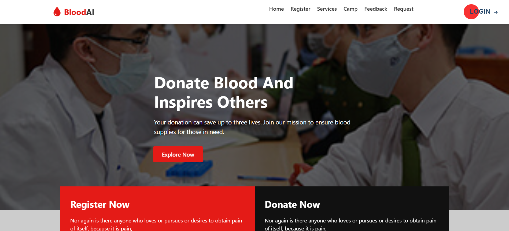
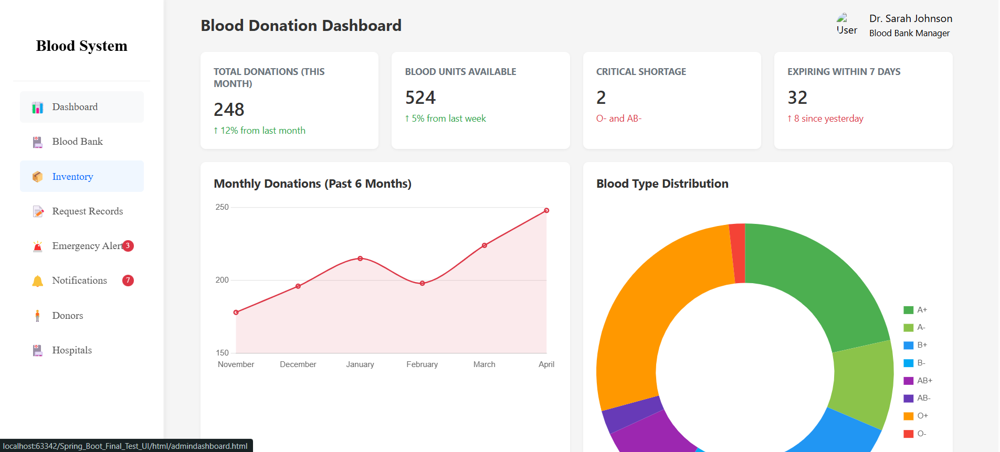
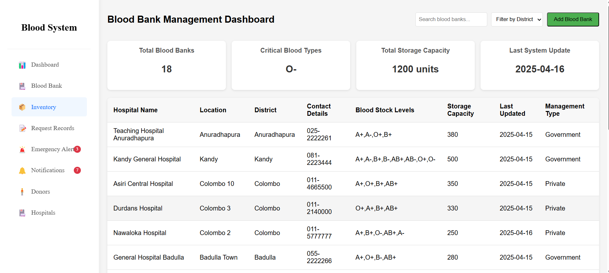
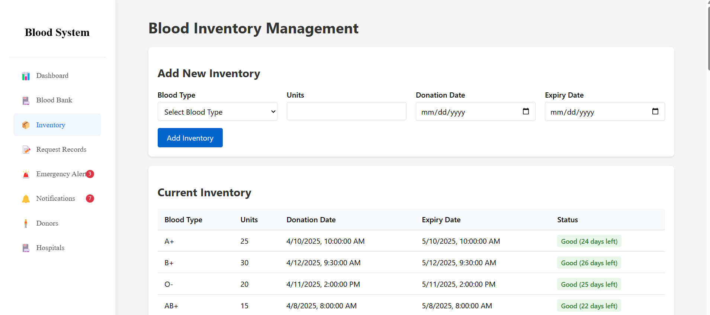
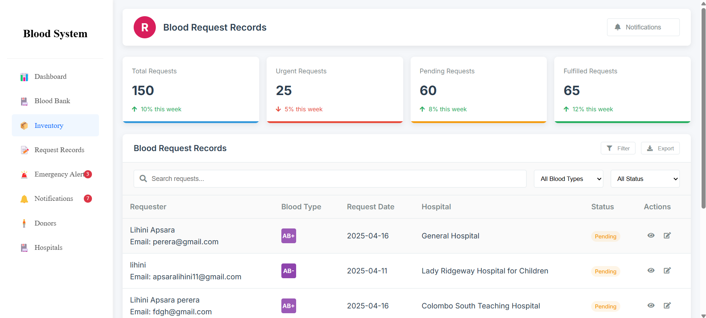
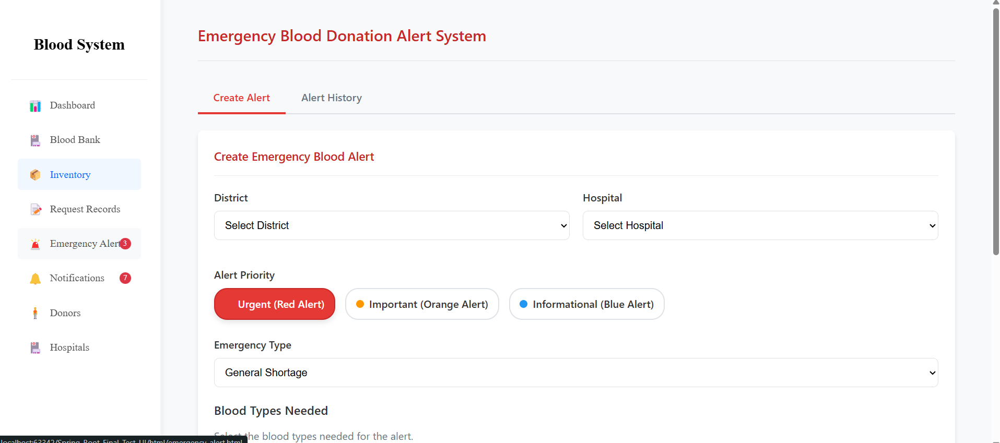
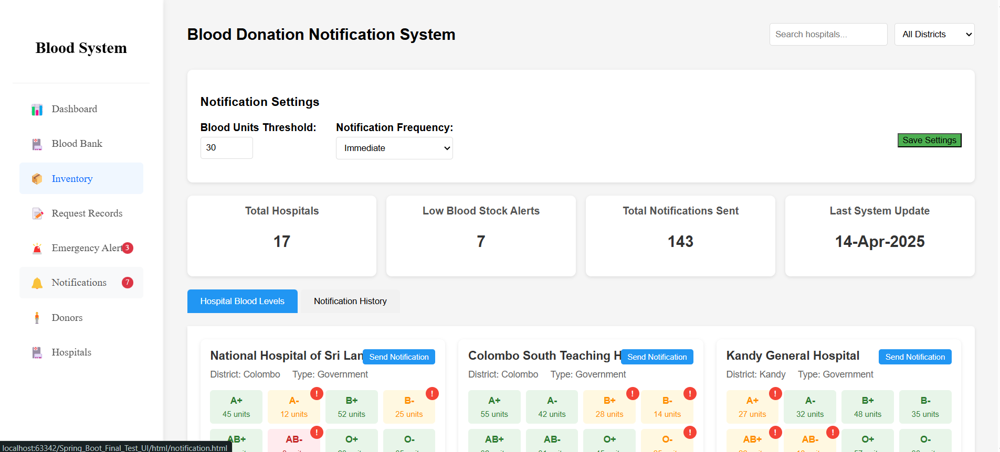
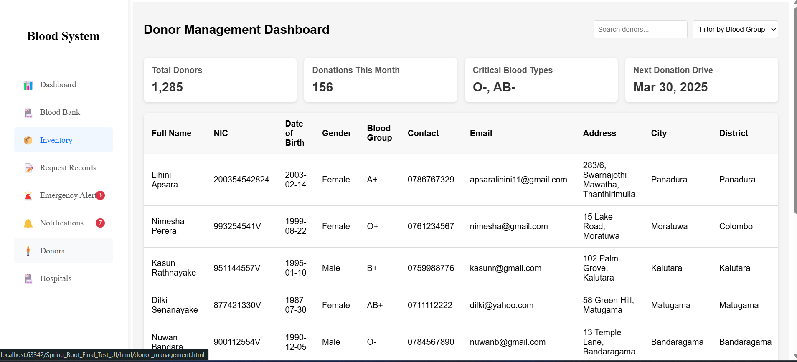
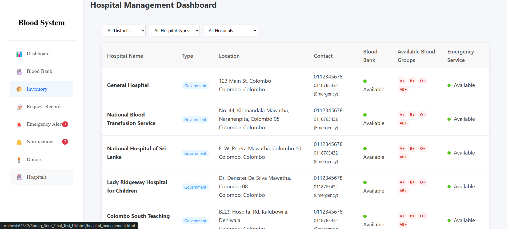
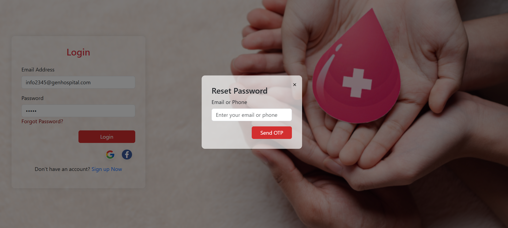
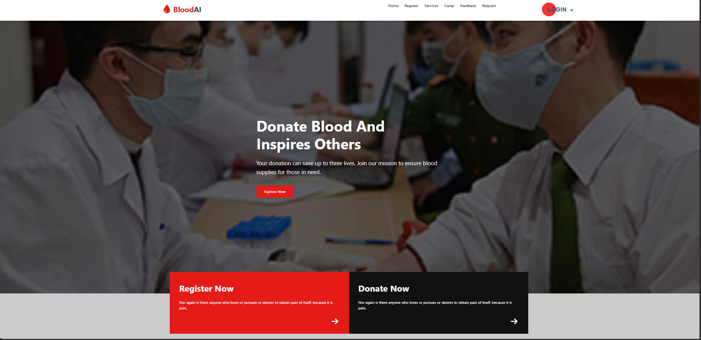
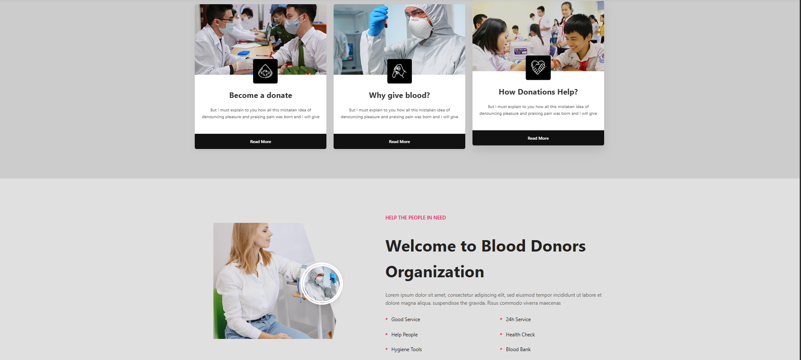

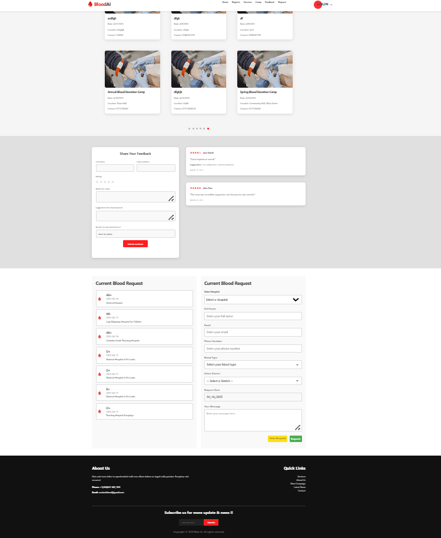

Description: This is a backend for blood donation project.

Here’s a brief description of a **Blood Donation System** in English:

A **Blood Donation System** is a structured process for collecting, testing, storing, and distributing blood to meet medical needs. It is typically managed by government or private hospitals, blood banks, and organizations like the Red Cross. In Sri Lanka, the **National Blood Transfusion Service (NBTS)** is the primary authority overseeing this system.

### Key Components:
1. **Donation**:
    - Volunteers (aged 18-60) donate blood after a health screening (checking hemoglobin levels, blood pressure, and medical history).
    - Approximately 450ml of blood is collected per donation.

2. **Storage**:
    - Donated blood is categorized into blood groups (A, B, AB, O) and Rh types (+ or -).
    - It is tested for diseases like HIV, Hepatitis B/C, and Syphilis to ensure safety.
    - Blood is stored in refrigerators (4°C) or freezers (-80°C). Red blood cells last 35-42 days, while plasma can be stored for over a year.

3. **Distribution**:
    - Blood is supplied to hospitals for surgeries, emergencies, thalassemia patients, pregnant women, and other medical needs.
    - Blood banks distribute blood directly to hospitals or patients as required.

4. **Management**:
    - Digital systems track blood supply, storage, and distribution.
    - Blood donation camps are organized to encourage public participation.

### Sri Lanka Context:
- The NBTS is one of Asia’s leading blood services, relying entirely on voluntary donations.
- Blood is provided free of charge, reducing the burden on patients.
- Special focus is given to patients requiring regular transfusions, like those with thalassemia.

### Importance:
- Blood donation saves lives, with a single donation potentially helping 3-4 people (by separating red cells, plasma, and platelets).
- It promotes community welfare and benefits donors’ health by stimulating new blood cell production.

you tube-link: https://youtu.be/IOd-wis4-u0

